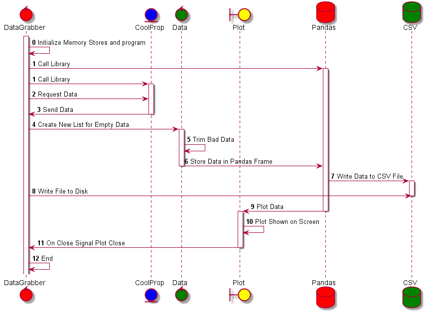

.. Thermo-Bridge Data Generator documentation master file, created by
   sphinx-quickstart on Wed Jan 18 17:32:44 2017.
   You can adapt this file completely to your liking, but it should at least
   contain the root `toctree` directive.

Welcome to Thermo-Bridge Data Generator's documentation!
========================================================

.. toctree::
   :maxdepth: 2
   :caption: Contents:

   readme
   DevTutorial
   thermoDataGrabber

Indices and tables
==================

* :ref:`genindex`
* :ref:`modindex`
* :ref:`search`

